# 108jobs-web — domain model class diagrams

> Generated from commit `2753127` (2026-09-07). Covers web-app-local business/state types: the chat module (its own domain/protocol/store layer), admin module, and app-level stores/contexts/hooks. Any vendored backend-DTO mirror is documented as a categorized inventory only (not exhaustively diagrammed) — full shapes live in the jh-api repo's own domain-model docs. React component prop types are excluded. Snapshot, not a live contract.


This document diagrams the business/state shapes that are genuinely *local* to the
108jobs-web frontend (Next.js/TypeScript) — Zustand stores, React contexts, and the
chat module's own domain/protocol/adapter layer. Types that are plain re-exports or
thin wrappers of `@108-plaza/jh-client` (the jh-api backend's generated client) are
noted where they matter for a shape's fields, but the client's own types are not
re-documented here — see the categorized inventory at the end.

---

## App State / Stores

### RequestState — the app's one shape for "where is this fetch"

`src/services/HttpService.ts:26-63` defines a four-state discriminated union that
every API call in the app is normalized into. `WrappedApiClient` (same file) wraps
every method on the generated `Api108Heros` client so it always resolves to a
`RequestState<T>` instead of throwing or returning bare data — an empty/loading pair
of singleton objects, plus `Failed`/`Success` carrying a payload. `useHttpGet`
(`src/hooks/api/http/useHttpGet.ts`) and `useHttpPost`/`Put`/`Delete` are the only
consumers that unwrap it into `{state, data, error, isLoading}` for components.

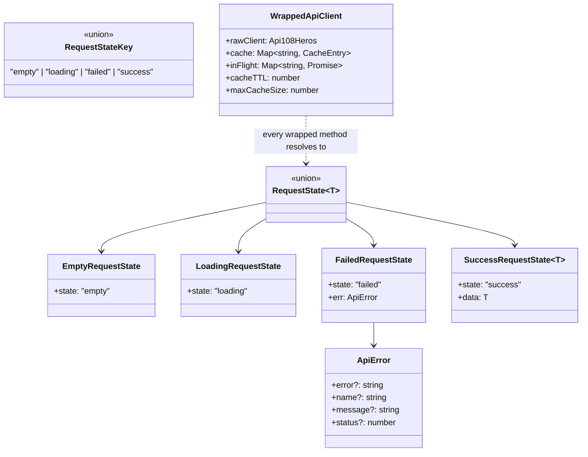

### IsoData — server-to-client hydration snapshot

`src/utils/types.ts:15-26`. The payload embedded in the initial HTML (`window.isoData`)
that seeds every store below in one pass on first paint — see
`UserServiceContext.tsx:36-99`, which reads `isoData.myUserInfo`, `.siteRes`,
`.categories`, `.chatRooms`, `.bankAccounts` and pushes each into its matching store.
Everything it carries besides `jwt`/`path`/`routeData` is a jh-client response type.

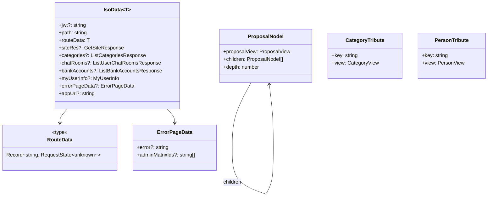

`ProposalNodeI`, `CategoryTribute` and `PersonTribute` (same file, lines 71-98) are
small tree/lookup wrappers built from jh-client views for tree rendering (proposal
threads) and @-mention-style tribute pickers; they live alongside `IsoData` in this
one central `src/utils/types.ts` file rather than in `src/types/`.

### useUserStore — the session's identity

`src/store/useUserStore.ts:5-23`. Holds the logged-in local user, person profile and
decoded JWT claims. `LocalUser`, `Person`, `MyUserInfo` are jh-client types; `Claims`
is local (`src/services/UserService.ts:14-24`) — the decoded shape of the app's own
auth JWT, checked by `isAdminClaims()` for the `jobs:admin` role.

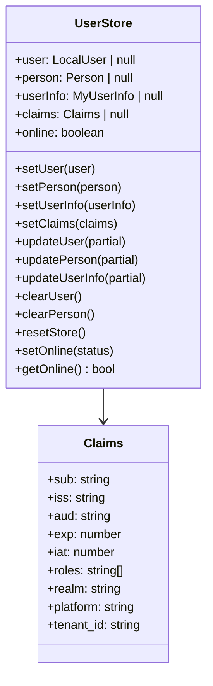

### useTermsStore — jobs-site ToS consent

`src/store/useTermsStore.ts:16-47`. Deliberately separate from `UserStore`: consent
is a per-app, per-version server record, not a boolean on the user, so this store
never folds it back in. Tracks whether the *jobs* consent check has completed at all
(`loaded`) so a not-yet-answered check never renders as "not accepted."

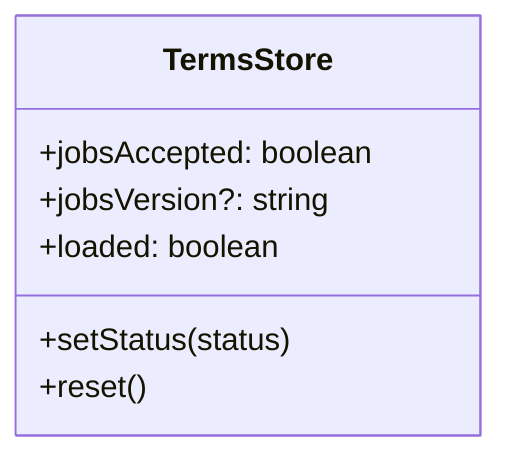

### useBankAccountsStore, useSiteStore, useCategoriesStore

Thin Zustand wrappers around jh-client response/view types, doing only
upsert/default/delete list bookkeeping. `useSiteStore.setSiteRes` derives every other
field (`admins`, `oauthProviders`, `activePlugins`, …) from one `GetSiteResponse`.

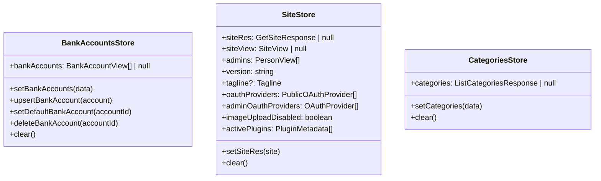

### networkStore

`src/store/networkStore.ts`. One boolean (`online`), flipped by
`ChatBridgeProvider`'s socket open/close/error handlers and the browser's own
`online`/`offline` window events — see the Chat Module section for the writer side.

### useNotificationStore — rider-application admin notifications

`src/store/useNotificationStore.ts` + `src/services/NotificationService.ts:5-42`.
Backs the admin notification dropdown. Notably tracks *fetch failure* as its own
flag (`loadFailed`, `unreadCountStale`) separately from an empty result, because
`NotificationService` never throws — every failure mode (401, 500, network) resolves
to `{state: FAILED}`, so without these flags a genuine outage was indistinguishable
from "no notifications" (issue #140/#142, referenced in the store's own comments).

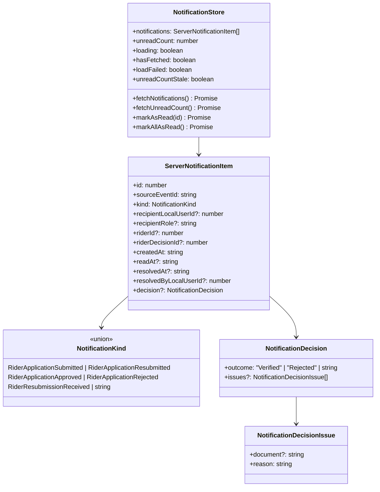

### Contexts — small UI-state providers

`AnnouncementContext.tsx:4-17` is the one context with a real domain shape — a
toast-style queue:

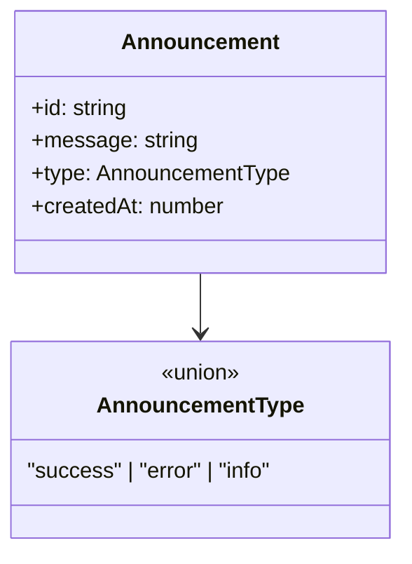

The rest are trivial value+setter pairs with no shape worth diagramming:
`GlobalErrorContext` (`{error: string|null, setError, clearError}`), `LanguageContext`
(`{lang: string, setLang}`), `ChatLanguage`'s `LanguageContextType`
(`{isLoading, error}`), and `UserServiceContext` (exposes the `UserService` singleton
plus does the `IsoData` → stores hydration pass described above).

---

## Admin

The admin module (`src/modules/admin/**`) is almost entirely UI wired directly to
jh-client types (`CategoryNodeView`, `Tag`, `LocalUserView`, …) — there is no admin
domain layer of its own. Two component-local shapes are worth noting because they
are draft/DTO-shaped state rather than plain prop types:

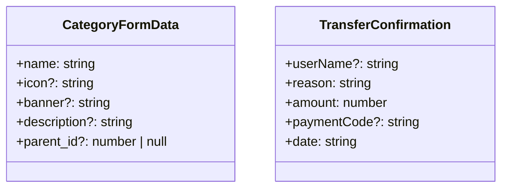

`CategoryFormData` (`src/modules/admin/components/Modal/CategoryModal/index.tsx:9-15`)
is the category-editor's draft state before it is submitted as a jh-client
create/update DTO. `TransferConfirmation` (inlined as the `transfer` prop's type in
`src/modules/admin/components/Modal/TransferConfirmModal/index.tsx:11-17`) is the
confirmation-dialog snapshot of a pending bank transfer.

`src/types/*` (`images.ts`, `layout.ts`, `catalogIcon.ts`) is confirmed to hold only
static-asset shape declarations (`StaticImageData` bundles) and one `LayoutProps`
component-prop type — no business/state types live there.

---

## Chat Module

The chat module (`src/modules/chat/**`) is this repo's largest genuinely-local
domain: a client-authored WebSocket wire protocol, a job-workflow state machine, and
several Zustand stores modeling messages/rooms/presence/unread — none of it mirrored
from jh-api's own client types beyond the base `ChatMessage`/`ChatRoomView` shapes.

### Wire protocol (`protocol/`, `types/common.ts`)

`protocol/wireEvents.ts:39-71` is the authoritative list of WebSocket event names,
kept variant-for-variant in sync with api-108heros's Rust `ChatEvent` enum (per its
own doc comment). `types/common.ts` layers the app's message/typing/packet shapes on
top of jh-client's `ChatMessage`.

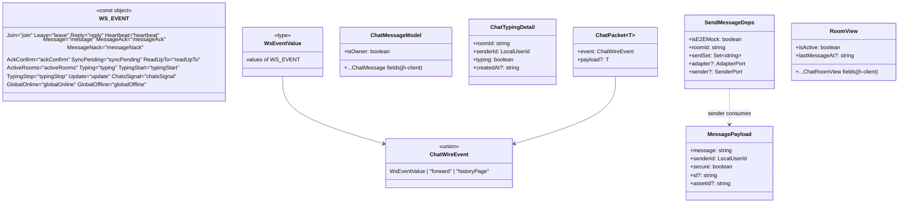

### Job workflow state machine (`types/workflow.ts`, `store/stateMachineStore.ts`)

The order-lifecycle state machine that drives the chat room's stepper UI
(`FreelanceChatFlow`). `WorkflowStatus` (imported from jh-client) is the state type;
everything around it — the transition table, the UI actions allowed per state, and
the generic FSM store that executes transitions — is web-local.

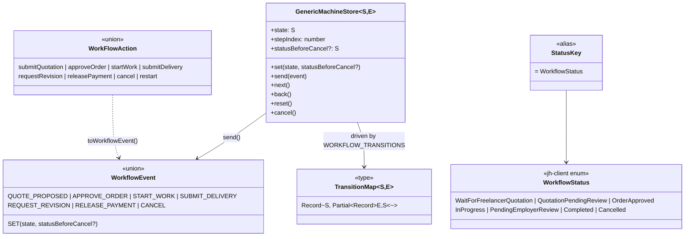

`workflowActionsMap: Record<WorkflowStatus, WorkFlowAction[]>` (`types/workflow.ts:45-53`)
gates which buttons render per state; `ACTION_TO_EVENT` maps a UI action to the FSM
event it fires. `useWorkflowActions` (`hooks/useWorkflowActions.ts:31-53`) is the
large dependency-injection hook that turns each action into an API call
(`ApproveQuotationForm`, `CreateInvoiceForm` — both jh-client) plus a structured chat
message announcing the transition; its `UseWorkflowActionsDeps` type is effectively
this workflow's full port list (17 fields: room/user context, seven API callables,
five UI setters).

### Message stores (`store/chatStore.ts`, `store/roomsStore.ts`)

`chatStore` holds messages keyed by room with optimistic-send/retry bookkeeping;
`roomsStore` holds the room list and delegates unread/read-receipt concerns to
sibling stores rather than owning them.

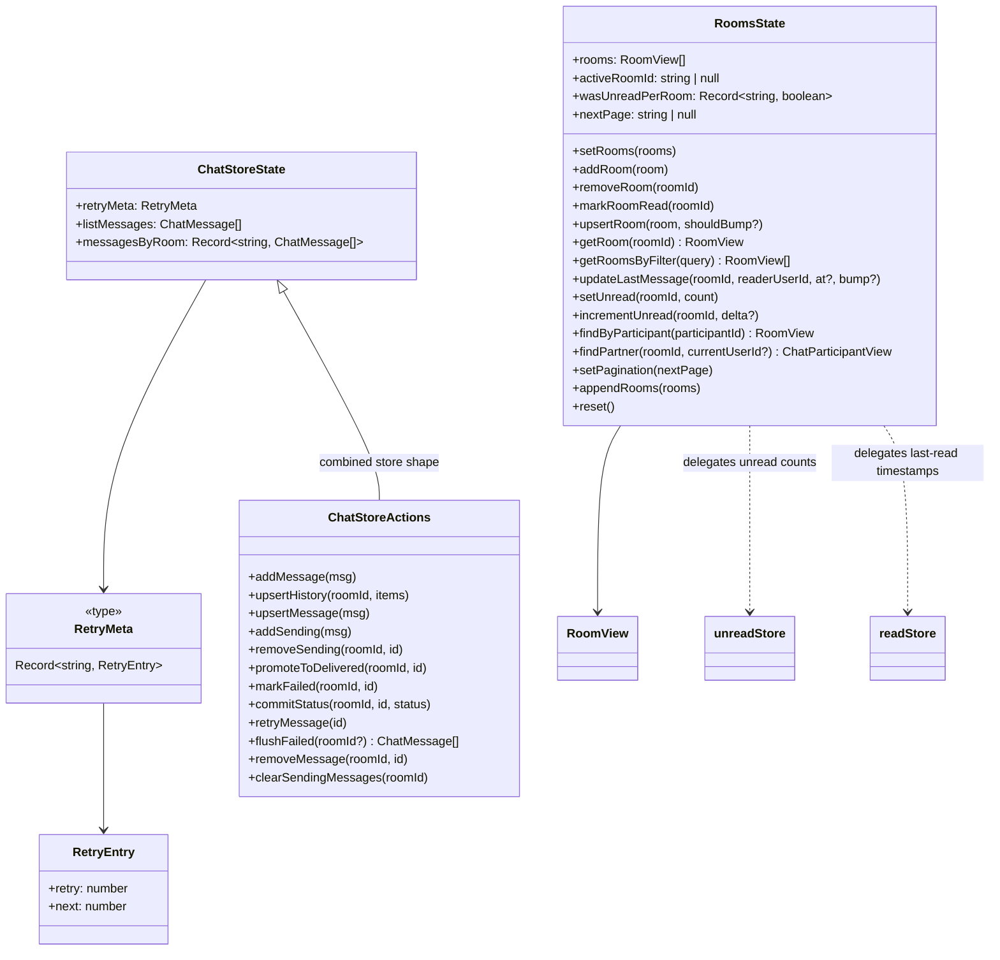

`roomsStore` deliberately does not own unread counts or read-receipt timestamps —
every mutator that touches either delegates to `unreadStore`/`readStore` (see below)
so there is exactly one place each concern is stored.

### Presence, unread, read-receipt, panel-UI stores

Four smaller, single-purpose stores:

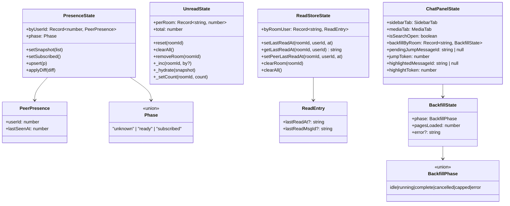

`ChatPanelState`'s `jumpToken`/`highlightToken` counters exist so a repeat request
for the *same* message id (clicking the same search result twice) still triggers a
re-render — a plain id field is, from a selector's point of view, unchanged on a
repeat set. `localAttachmentPreviewStore.ts` (not diagrammed — one field,
`byAssetId: Record<string, string>` mapping an asset id to a local blob URL with a
30s auto-release timer) exists for the same instant-preview-before-network-confirms
purpose as `AttachmentPreview` below, at a different stage of an attachment's life.

### WebSocket transport (`services/ChatSocketService.ts`)

The hand-rolled client for wire protocol v2 (this used to wrap the `phoenix` npm
client against an Elixir relay; both are gone, replaced by a plain WebSocket with a
JSON envelope). `ChatSocket` owns one physical connection with ref/reply
correlation, a send buffer for frames written before OPEN, and reconnect backoff;
`ChatChannel` is one room's view of it; `ChatPush` is the thenable-like handle
`.push()` returns.

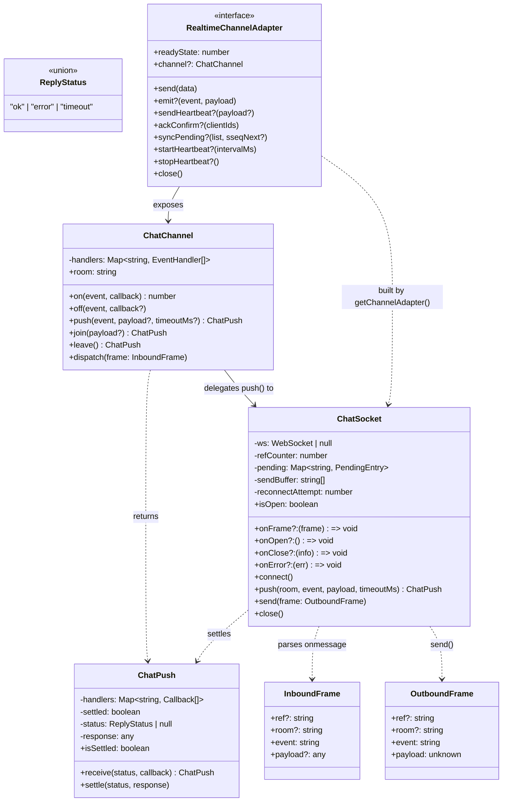

`getChannelAdapter(token, room, roomId, senderId, opts)` is the factory that wires a
`ChatSocket` + `ChatChannel` pair into one `RealtimeChannelAdapter`, translating
protocol events into the normalized envelope `useWebSocket` consumes.

### Sending, acking, resending (`adapters/`, `services/ResendManager.ts`, `utils/AckMatcher.ts`)

The three collaborating pieces that turn a queued send into a confirmed, deduplicated
message, wired together by `ChatBridgeProvider` (see below).

```mermaid
classDiagram
    class ChatSenderPort {
        <<interface>>
        +sendMessage(event, draft: SendDraft) Promise~string|false~
    }
    class SendDraft {
        <<alias>>
        = ChatMessage
    }
    class ChatChannelLike {
        <<type>>
        +push(event, payload) Promise|unknown
    }
    class ChatSenderAdapter {
        -socket: ChatChannelLike | WebSocket
        +sendMessage(event, payload) Promise~string|false~
    }
    ChatSenderAdapter ..|> ChatSenderPort
    ChatSenderAdapter --> ChatChannelLike

    class ChatStorePort {
        <<interface>>
        +getState() { failedMessages, retryMeta }
        +upsertRetryMeta(id, meta)
        +dropRetryMeta(id)
        +markFailed(roomId, id)
        +promoteToSent(roomId, id)
    }
    class ResendManager {
        -isResendingAll: boolean
        -isResendingActive: boolean
        -inFlight: Set~string~
        -baseDelays: number[]
        +onSendFailure(messageId, roomId)
        +flushActive(roomId) Promise
        +flushAll() Promise
    }
    ResendManager --> ChatStorePort : store
    ResendManager --> ChatSenderPort : sender

    class AckEvent {
        +clientId?: string
        +serverId: string
        +roomId: string
        +senderId: number
    }
    class AckMatcher {
        -clientToServer: Map~string, string~
        -listeners: Set~AckListener~
        -timeoutMs: number
        +onAck(ack: AckEvent)
        +trackPending(clientId)
        +isAcked(clientId) boolean
        +hasServerId(serverId) boolean
        +subscribe(listener) Unsubscribe
    }
    AckMatcher --> AckEvent
```

`ResendManager` retries a failed send up to 3 times with jittered exponential
backoff (`baseDelays = [1000, 2000, 5000]`); `flushActive` wakes one room (a UI retry
button), `flushAll` wakes every room (an offline→online transition). `AckMatcher`
is a global singleton (`GlobalAckMatcher`) that correlates the client-generated id a
message was sent with against the server id an ack/nack carries back.

### Wiring: ChatBridgeProvider and WebSocketContext

Not a data shape but the composition root worth showing, since it is where every
class above is actually instantiated and connected to the stores:

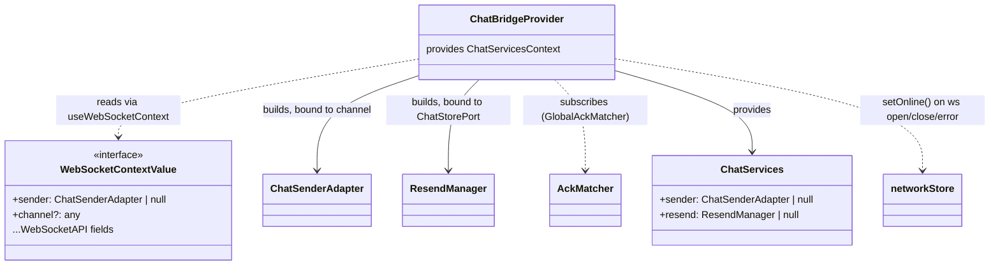

`UseWebSocketOptions`/`WebSocketAPI` (`hooks/useWebSocket.ts:9-78`) are the
lower-level hook's input/output contract that `WebSocketContext.tsx` re-exposes,
enriched with `sender`/`channel` fields for consumers like `ChatBridgeProvider`.
`UserEventsContext.tsx` runs a second, parallel `useWebSocket` connection scoped to
`user:<id>:events` (no room join) for cross-room signals; its own
`UserEventEnvelope` type (`{event?, payload?: {kind?, roomId?, unreadCount?,
lastMessageAt?, senderId?}}`) is the shape it expects on that channel.

### Attachments (`attachments/`)

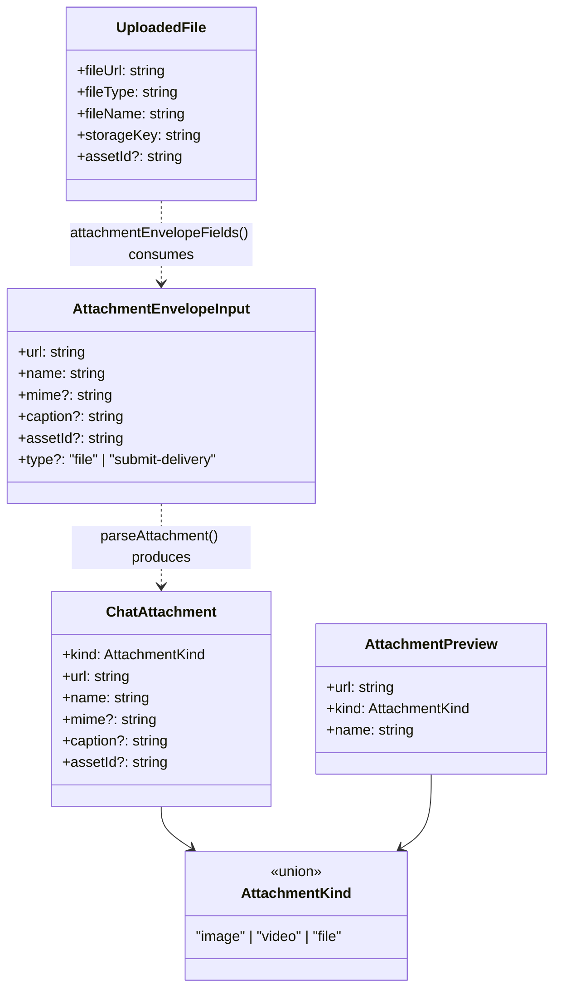

`parseAttachment(content)` (`attachments/parseAttachment.ts:39-59`) is the one place
a message's `content` is inspected for a file envelope, returning `ChatAttachment |
null`. `buildAttachmentEnvelope`/`attachmentEnvelopeFields` are its write-side
counterpart. `UploadedFile` (`hooks/useFileUpload.ts:11-20`) is the result of a
completed upload; `AttachmentPreview` is the instant, pre-upload local-blob preview
shown the moment a file is picked, before any network round trip.

### Search

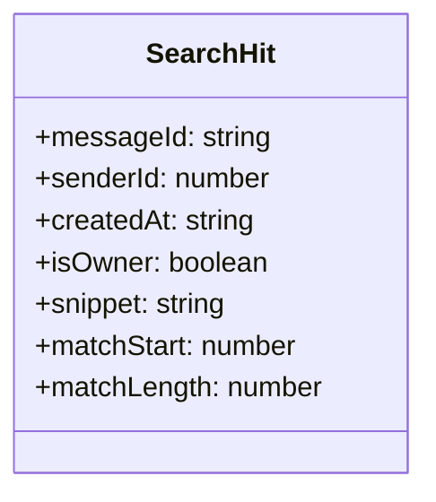

`searchMessages(messages, rawQuery)` (`search/searchMessages.ts:99-128`) runs over
already-decrypted, already-loaded messages client-side (the server only ever held
ciphertext) and returns `SearchHit[]`, newest first.

### History paging & backfill

```mermaid
classDiagram
    class HistoryPagerState {
        +pageCursor: string | null
        +hasMore: boolean
        +isFetching: boolean
    }
    class FetchPageResult {
        +prevCursor: string | null
    }
    class HistoryPagerDeps {
        +fetchPage(cursor) Promise~FetchPageResult~
        +onState?(state)
    }
    class HistoryPager {
        <<interface>>
        +fetchOnePage() Promise
        +hasMore() boolean
        +reset()
    }
    HistoryPagerDeps --> FetchPageResult
    HistoryPager ..> HistoryPagerState : reports via onState

    class BackfillOutcome {
        <<union>>
        "complete" | "cancelled" | "capped"
    }
    class BackfillDeps {
        +fetchOnePage() Promise
        +hasMore() boolean
        +signal?: { aborted: boolean }
        +onPage?(pagesLoaded)
        +maxPages?: number
    }
    BackfillDeps ..> HistoryPager : wraps the same fetchOnePage/hasMore
    BackfillDeps ..> BackfillOutcome : runBackfill() resolves to
```

`createHistoryPager` is a plain factory (not a React hook) holding mutable
paging state in closure variables rather than `useState`, specifically so
`runBackfill`'s loop can call `fetchOnePage` many times synchronously within one
render without each call reading a stale value. `runBackfill` layers a hard
`maxPages` cap (default 200) and cooperative cancellation via an `AbortSignal`-shaped
`signal` on top of one pager.

### Small supporting types

`MessageStatus`/`ReplyStatus`-adjacent unions and DTOs used at the edges: `TypingEvent
= {roomId, senderId, typing}` (`hooks/usePartnerTyping.ts:8`); `MediaLoadRetry`
(`hooks/useMediaLoadRetry.ts:7-38`, the `{attemptKey, failed, loaded, handleError,
handleLoad}` returned by the shared bounded-retry hook for ``/`<video>` loads);
`SendEventDeps` (`events/sendEvents.ts:21-26`, the minimal `{roomId, senderId,
adapter?, sender?}` every lightweight emit function takes); `UserEventEnvelope`
(above); `ChatReadReceiptDetail = {roomId, lastMessageId, readerId}`
(`events/chatEvents.ts:72`) for the in-page DOM CustomEvent read-receipt channel,
kept deliberately separate from the WebSocket wire protocol.

---

## `@108-plaza/jh-client` — categorized inventory (not diagrammed here)

This repo has no vendored client directory (no `src/lib/jh-client` or similar) — it
depends on `@108-plaza/jh-client` as an ordinary npm package (`package.json:19`,
`"@108-plaza/jh-client": "^1.0.0"`). Its full shapes are the jh-api backend's own
generated contract and are documented in that repo; listed here only as an inventory
of what this frontend actually imports, grouped by theme, so a reader knows where to
look rather than re-deriving the same types from backend docs.

- **Client / plumbing**: `Api108Heros`
- **Auth / identity**: `IdentityPlatformLoginResponse`, `RegistrationMode`
- **Person / user**: `LocalUser`, `LocalUserId`, `LocalUserView`, `MyUserInfo`,
  `Person`, `PersonId`, `PersonView`, `SaveUserSettings`, `BanPerson`
- **Site / platform config**: `GetSiteResponse`, `SiteView`, `EditSiteRequest`,
  `OAuthProvider`, `PublicOAuthProvider`, `CreateOAuthProvider`, `PluginMetadata`,
  `Tagline`
- **Categories / tags**: `CategoryId`, `CategoryView`, `CategoryNodeView`, `Tag`,
  `ListCategoriesResponse`
- **Posts / proposals / jobs**: `CreatePost`, `Post`, `PostId`, `PostView`,
  `PostPreview`, `PostSortType`, `CreateProposal`, `ProposalId`, `ProposalView`,
  `JobType`, `IntendedUse`, `LanguageId`, `SearchCombinedView`
- **Chat**: `ChatMessage`, `ChatMessageView`, `ChatMessagesResponse`, `ChatRoom`,
  `ChatRoomId`, `ChatRoomView`, `ChatParticipantView`, `ChatStatus`,
  `ListUserChatRoomsResponse`, `PaginationCursor`
- **Presence**: `PresenceSnapshotItem`, `PresenceStatus`
- **Workflow / billing**: `WorkflowId`, `WorkflowStatus`, `ApproveQuotationForm`,
  `CreateInvoiceForm`
- **Banking / payments**: `Bank`, `BankId`, `BankAccountId`, `BankAccountView`,
  `ListBankAccountsResponse`, `AdminTopUpWallet`, `TopUpRequestView`,
  `TopUpResponse`, `TopUpStatus`, `ListTopUpRequestQuery`, `WithdrawRequestView`,
  `WithdrawStatus`, `ListWithdrawRequestQuery`
- **Reviews / portfolio**: `SubmitUserReviewForm`, `UserReviewView`, `WorkSample`,
  `PortfolioPic`

Full field-level shapes for all of the above live in the jh-api repo's own generated
client docs, not in this document.
